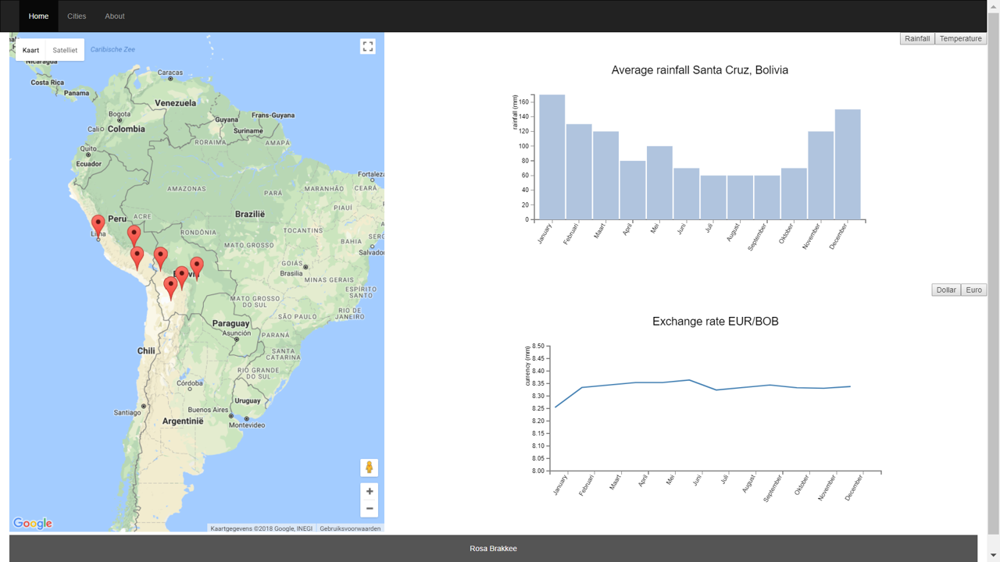

# WEEK 1
## day 1
- First general idea
- Github structure

## day 2
- README.md

## day 3
- DESIGN.md

## day 4
- main.html
- page layout
- Map on page with google api

## day 5
- barchart.js
- linechart.js
- queue.js

# WEEK 2
## day 8
- first version for temperature chart for santa cruz data
- interactive element that links click on the city marker to the weather graphs
- update graph to rainfall <-> temperature works
