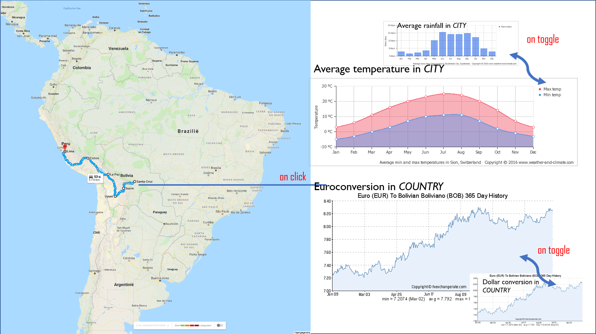

# Project Proposal
## Work in progress

https://rosabrakkee.github.io/ProgProject/main.html

## Problem Statement
Over the last few years, South-America has become a popular traveling destination for many backpackers. Historical relics, architectural and natural wonders, a diverse range of foods and culture, vibrant and colorful cities, and stunning landscapes attract millions of tourists every year to South America. Because of widespread and diverse wonders South-America has to over, it might be hard and overwelming to plan your trip. There is lack of a clear overview and a suggestion on the best route for a backpacker that is dreaming of an adventure through South-America.

## Solution

This visualisation is going to be an interactive map of a popular route through South-America. This maps allows for interactive information on clicking a city / place on the route. The information will help a traveller make a desicion on the best time to visit the city, how much money to bring and how touristy the place is.

## Prerequisites
##### Data source
- Euro vs. foreign currencies: http://www.xe.com/currency/eur-euro

##### External components
- Google API for map: https://developers.google.com/maps/documentation/javascript/
- Google places API
- Accuweather API

##### Review of similar visualizations
- Add cities using Google API and d3: https://bl.ocks.org/mbostock/raw/899711/
- Overlay map on google map for interactive d3 elements: http://www.bmdata.co.uk/effective/index_map.html
- More on svg overlay element:
- How to create a route: https://stackoverflow.com/questions/27341214/how-to-draw-a-route-between-two-markers-in-google-maps

##### Possible technical problems or limitations
- Scrapping data for all cities
- Interactive elements on click
- Adding route to the map
